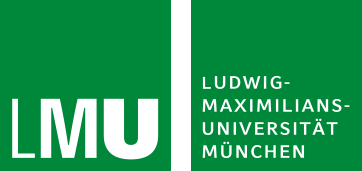
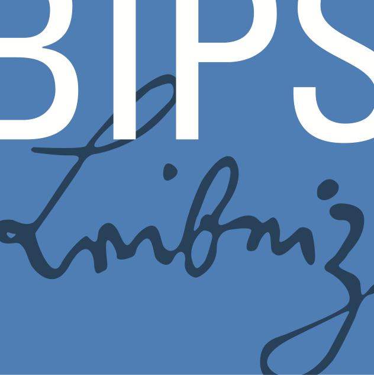

**InterACT** is a collaborative workshop between the [interpretable machine learning / explainable AI group][slds-iml] lead by [Dr. Giuseppe Casalicchio][giuseppe] of the Chair of Statistical Learning and Data Science (SLDS) of [LMU Munich][lmu] lead by [Prof. Dr. Bernd Bischl][bernd] and the [Emmy Noether Junior Research Group][emmy] lead by [Prof. Dr. Marvin N. Wright][marvin] of the Leibniz Institute for Prevention Research and Epidemiology - BIPS.

The workshop is aimed primarily at PhD students in the field of interpretable machine learning (IML) and explainable AI (XAI) and includes postdoctoral and senior researchers.

## Past Workshops

InterACT #1 was held November 13th -- 16th 2023 in Munich.  
Among many brainstorming session, it laid the foundation for @ewald2024guidefeature and spawned the "CountARFactuals" project @dandl2024countarfactuals, bridging counterfactual explanations and tree-based generative modeling.

InterACT #2 was held September 23rd -- 26th 2024 in Bremen.
It was directly supported by the [Minds, Media, Machines Integrated Graduate School (MMMIGS) PhD Grant Bremen][mmmigs], and among others lead to @kapar2025whatswrongsynthetictabular, combining generative modeling with interpretable machine learning.

## Supporting Organizations

InterACT is made possible by the following organizations whose support is greatly appreciated:

::: organizations

::: {layout-ncol=3 layout-valign="center"}
[][lmu]

[][bips]

[][unibremen]

[][mcml]

[][mmm]
:::

:::

## All Publications

::: {#refs}
:::

<!-- Links -->
[bernd]: https://www.slds.stat.uni-muenchen.de/people/bischl/
[giuseppe]: https://www.slds.stat.uni-muenchen.de/people/casalicchio/
[marvin]: https://www.bips-institut.de/en/contact/staff/research-fellow.html?MAid=1110&cHash=9562bd57df9719623f7e6fcd7e1c693b

[slds-iml]: https://www.slds.stat.uni-muenchen.de/research/explainable-ai.html
[slds]: https://www.slds.stat.uni-muenchen.de/
[lmu]: https://www.lmu.de/en/
[emmy]: https://www.bips-institut.de/das-institut/abteilungen/biometrie-und-edv/emmy-noether-nachwuchsgruppe-beyond-prediction-statistical-inference-with-machine-learning.html
[bips]: https://www.bips-institut.de/en/index.html

[mcml]: https://mcml.ai
[mmm]: https://minds-media-machines.de
[mmmigs]: https://minds-media-machines.de/en/promotionsprogramme/
[unibremen]: https://www.uni-bremen.de/
