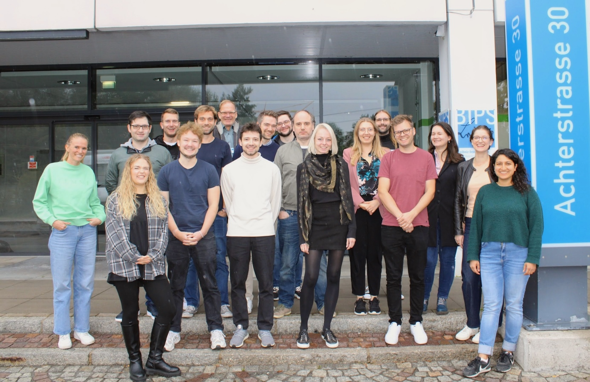

InterACT #4 will be September 14th -- 17th in Bremen!

InterACT #3 was held  September 1st -- 4th 2025 at the Chair of Statistical Learning and Data Science in Munich.

InterACT #2 was held September 23 -- 26 2024 at the Leibniz Institute for Prevention Research and Epidemiology --- BIPS in Bremen.

{fig-alt="A group photo of the InterACT #2 members in front of the BIPS building" fig-align="center" width=80%}

InterACT #1 was held September 13 -- 16 2023 at the Chair of Statistical Learning and Data Science in Munich.
