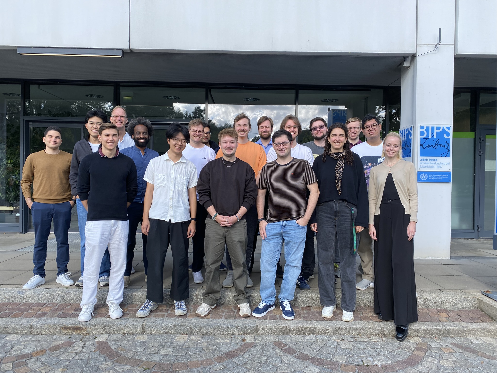
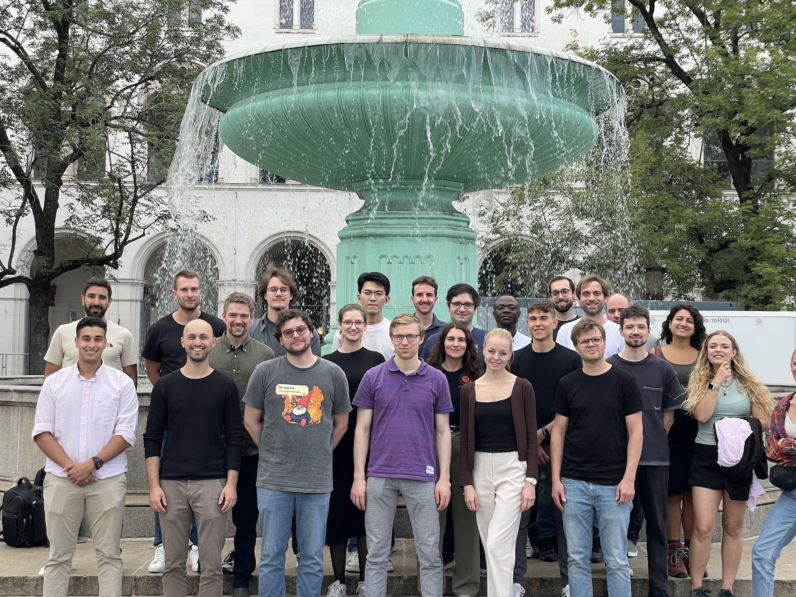

**InterACT** is a collaborative workshop between the [interpretable machine learning / explainable AI group][slds-iml] led by [Dr. Giuseppe Casalicchio][giuseppe] of the Chair of Statistical Learning and Data Science (SLDS) of [LMU Munich][lmu] led by [Prof. Dr. Bernd Bischl][bernd] and the [Emmy Noether Junior Research Group][emmy] led by [Prof. Dr. Marvin N. Wright][marvin] of the Leibniz Institute for Prevention Research and Epidemiology --- BIPS.

The workshop is aimed primarily at PhD students in the field of interpretable machine learning (IML) and explainable AI (XAI) and includes postdoctoral and senior researchers. It takes place annually over four days, alternating between Munich and Bremen.

## Workshops

### InterACT #4 {.workshop}

[Bremen, September 14 -- 17, 2026]{.meta}

{fig-alt="A group photo of the InterACT #4 members in front of BIPS" fig-align="center"}

### InterACT #3 {.workshop}

[Munich, September 1 -- 4, 2025]{.meta}

{fig-alt="A group photo of the InterACT #3 members in front of Schalenbrunnen in Munich" fig-align="center"}

### InterACT #2 {.workshop}

[Bremen, September 23 -- 26, 2024]{.meta}

Directly supported by the [Minds, Media, Machines Integrated Graduate School (MMMIGS) PhD Grant Bremen][mmmigs]. Among others, it led to @kapar2025whatswrongsynthetictabular, combining generative modeling with interpretable machine learning.

{fig-alt="A group photo of the InterACT #2 members in front of the BIPS building" fig-align="center"}

### InterACT #1 {.workshop}

[Munich, November 13 -- 16, 2023]{.meta}

Among many brainstorming sessions, it laid the foundation for @ewald2024guidefeature and spawned the "CountARFactuals" project [@dandl2024countarfactuals], bridging counterfactual explanations and tree-based generative modeling.

## Supporting Organizations

InterACT is made possible by the following organizations whose support is greatly appreciated:

::: organizations

::: {layout-ncol=3 layout-valign="center"}
[][lmu]

[][bips]

[][unibremen]

[][mcml]

[][mmm]
:::

:::

## Publications

::: {#refs}
:::

<!-- Links -->
[bernd]: https://www.slds.stat.uni-muenchen.de/people/bischl/
[giuseppe]: https://www.slds.stat.uni-muenchen.de/people/casalicchio/
[marvin]: https://www.bips-institut.de/en/contact/staff/research-fellow.html?MAid=1110&cHash=9562bd57df9719623f7e6fcd7e1c693b

[slds-iml]: https://www.slds.stat.uni-muenchen.de/research/explainable-ai.html
[lmu]: https://www.lmu.de/en/
[emmy]: https://www.bips-institut.de/das-institut/abteilungen/biometrie-und-edv/emmy-noether-nachwuchsgruppe-beyond-prediction-statistical-inference-with-machine-learning.html
[bips]: https://www.bips-institut.de/en/index.html

[mcml]: https://mcml.ai
[mmm]: https://minds-media-machines.de
[mmmigs]: https://minds-media-machines.de/en/promotionsprogramme/
[unibremen]: https://www.uni-bremen.de/
